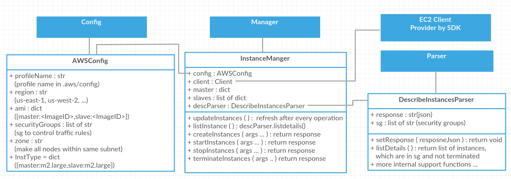

# JmeterAwsConf (based on boto3)

## overview
...

## Todo
1. class seperate
2. reduce dependency 
2. task manager
3. comments and docs
3. cluster / environment overall design refactoring


## pointer
1. always one master
2. one cluster one task each times

## Prerequisites

1. *python3*
2. package:*virtualenv*; setup a virtual environment
3. *awscli* for python
2. *config*(rigion and profile) and *credentials*
3. package:*boto3*
4. package:*paramiko*
5. .profile:`alias cli="source <virtual-env>/bin/activate"`
6. make sure `VIRTUAL_ENV` correct
7. add `PYTHONSTARTUP` in *\<virtual-env\>\bin\activiate*, point to *\<virtual-env\>\autoscripts\startup.py*  
 	
 	startup.py  
 	```python
 	import JmeterAwsConf as j
 	```
 	
6. [optional]modified: *\<virtual-env\>\bin\activiate*: alias `syn` cmd;`cd` to directory

	>cd ~/Desktop/AWS_TEST  
	>alias syn='rm -r ~/Desktop/AWS_TEST/cli-ve/lib/python3.6/site-packages/JmeterAwsConf/*;rsync -a --exclude=".*" ~/Desktop/AWS_TEST/JmeterAwsConf/ ~/Desktop/AWS_TEST/cli-ve/lib/python3.6/site-packages/JmeterAwsConf'
	
7. make sure things are correct in config.json
8. ...

#### Tricky things:
**virtual_env**: always be ware of under which environment you are and if your python package is installed in virtual_env or global env.

### |##Solution to this**: a script to handle everything.    

**|##########################################|** 

## Components

Three roles: **Config**, **Parser**, **Manager**


**config** keeps configuration variables which import config.json.  
**parser** is responsible for parsing the response from ec2 client.  
**instance manager** controls instances lifecycle and some info like IPs.  

More **Scheduler**, **SSHManager**, **SSHConfig** ...