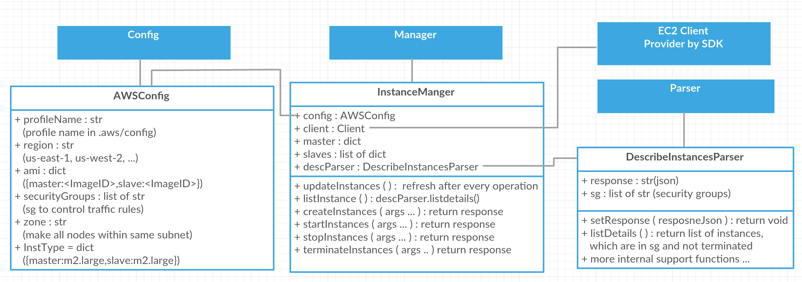
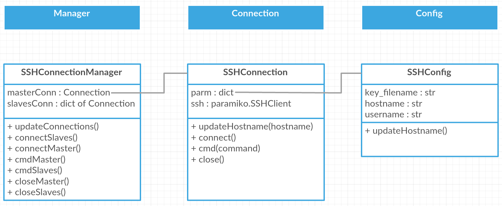

# JmeterAwsConf (based on boto3)

## overview
...

## Todo
1. task manager documentation 
2. health status

### questions
1. compress the files before upload to s3?

### problem:

whitelist

## points
1. always one master
3. The usernames to login EC2 instances should be same, now it is "ubuntu". 
4. The ssh key file is also same in the cluster.
5. configuration parameters are stored under /config
6. Master/slaves are identified by tag, (i.e. \_\_JAC\_\<key name\>\_\_), don't change tag!
4. one cluster is responsible for only on tasks. multiple clusters
5. 

## Prerequisites

1. *python3*
2. package:*virtualenv*; setup a virtual environment
3. *awscli* 
2. *config*(rigion and profile) and *credentials*, as well as profile [see aws config documents]
3. package:*boto3*
4. package:*paramiko*
5. .profile:`alias cli="source <virtual-env>/bin/activate"`
6. make sure `VIRTUAL_ENV` correct
7. [**optional**]add `PYTHONSTARTUP` in *\<virtual-env\>\bin\activiate*, point to *\<virtual-env\>\autoscripts\startup.py*  
 	
 	startup.py  
 	```python
 	import JmeterAwsConf as j
 	```
 	
6. [**optional**]modified: *\<virtual-env\>\bin\activiate*: alias `syn` cmd;`cd` to directory

	>cd ~/Desktop/AWS_TEST  
	>alias syn='rm -r ~/Desktop/AWS_TEST/cli-ve/lib/python3.6/site-packages/JmeterAwsConf/\*;rsync -a --exclude=".\*" ~/Desktop/AWS_TEST/JmeterAwsConf/ ~/Desktop/AWS_TEST/cli-ve/lib/python3.6/site-packages/JmeterAwsConf'
	
7. make sure things are correct in config.json
8. ...

### deployment step
1. update[ubuntu only]  

		sudo apt-get update  
		sudo apt-get upgrade
	
2. python3.5 is already installed on ec2 instance so next pip

		sudo apt-get install python3-pip

3. install packages
 
		sudo apt-get install python3-paramiko
		sudo pip3 install boto3 
		sudo pip3 install awscli

5. upload JAC / .aws / keys
	
		scp -i Jmeter_test_key_pair.pem -r ~/Desktop/AWS_TEST/JmeterAwsConf ubuntu@ec2-35-163-234-231.us-west-2.compute.amazonaws.com:~/dev
		scp -i Jmeter_test_key_pair.pem -r ~/.aws/ ubuntu@ec2-35-163-234-231.us-west-2.compute.amazonaws.com:~/.aws
		scp -i Jmeter_test_key_pair.pem -r Jmeter_test_key_pair.pem ubuntu@ec2-35-163-234-231.us-west-2.compute.amazonaws.com:~/
		
6. sync to local lib
	
		rsync -a "--exclude=.*" src/ ~/.local/lib/python3.5/site-packages/JmeterAwsConf
7. 

#### Tricky things:
**virtual_env**: always be ware of under which environment you are and if your python package is installed in virtual_env or global env.

### |##Solution to this**: a script to handle everything.    

**|##########################################|** 

## Components

Four roles: **Config**, **Parser**, **Manager**, **Connection**

### Instance Manager


**config** keeps configuration variables which import config.json.  
**parser** is responsible for parsing the response from ec2 client.  
**instance manager** controls instances lifecycle and some info like IPs.  

More **Scheduler**, **SSHManager**, **SSHConfig** ...

### Connection Manager
Three roles: **Config**, **Manager**


**config** keeps configuration variables which import config.json.  
**connection** is responsible for buliding ssh channel between aws ec2 node and local client.  
**SSH connection manager** passing command to the remote nodes to excute  
